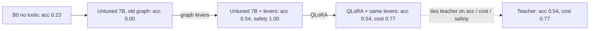
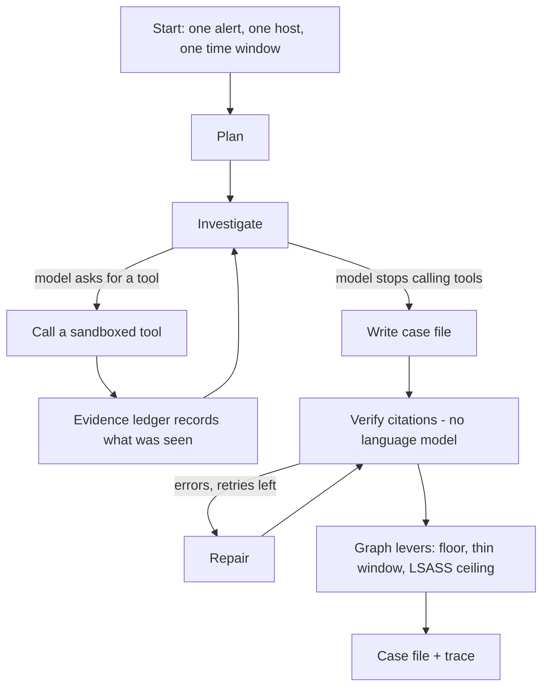
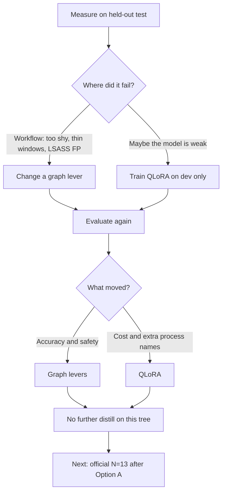
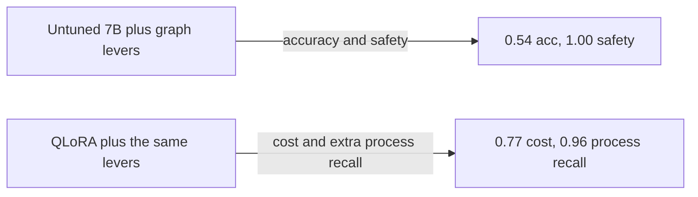

# alert2attack

EDR investigation agent (LangGraph) · sourced case files · measured on OTRF · [MIT](LICENSE)

It takes one EDR alert plus a boxed slice of host telemetry and writes a sourced case file: verdict, in-scope processes, ATT&CK techniques, and what a human should do next. Every claim points at evidence the agent fetched on this run (`ev-0123`, a Sigma rule, an ATT&CK id). A LangGraph tool loop investigates, a deterministic citation verifier strips unsupported claims, and graph levers run after verify. The agent recommends. A person still decides. It never isolates a host or kills a process by itself.

It does not detect anything: detection already fired. This is the next step, investigating the alert without inventing citations. v1 is built, measured, and can be served locally. It is a prototype, not a shipped product.

A web console in `web/` (React and TypeScript) sits on top of the agent. It shows an investigation as it runs and lets you click any citation through to the evidence behind it. See [Console](#console).

## Demo

> Placeholder. Add a short GIF of the console running an investigation (the live trace, then a citation opening its evidence) and one of `uv run alert2attack investigate …` printing a case file. Suggested paths: `docs/demo/console-trace.gif` and `docs/demo/investigate-casefile.gif`. The console's `replay` model makes the first one reproducible without a model.

## After one read

1. Problem. EDR alerts overwhelm analysts, a wrong isolate is costly, and a generic model invents citations.
2. How it investigates. Plan, then a tool loop that reads only through the ledger, then write, verify and repair, and graph levers. Tools only, no gold in the store, and a human still decides.
3. Why graph levers. The first 7B already cited real evidence but would not say "malicious." Same model, better job steps: accuracy and safety moved on the flowchart.
4. Frozen OTRF test (N=13). Graph levers (EXP-005): verdict acc 0.54, action safety 1.00. QLoRA (EXP-004): mean cost 0.77, key-pid 0.96. Citations are 1.00 on every 7B row after verify.
5. What is frozen and what is next. Training is on hold. Option A is on main. The official N=13 has not been re-run after that change, so do not claim the logonpasswords miss is gone.
6. The console. `web/` shows a run live and opens the evidence behind any citation. It works without a model through a canned `replay` responder.

## The problem

EDR (endpoint detection and response) products watch laptops and servers. When something looks like an attack, they raise an alert: "this process opened LSASS," "this script launched PowerShell," "this scheduled task appeared."

A SOC analyst then has to answer, under time pressure:

1. Is this a real attack, a false alarm, or not enough to say?
2. Which process is in scope?
3. What should we do next: isolate the host, kill a process, or close it as benign?

That queue overwhelms people. A wrong isolate takes a machine off the network, which is costly when the alert was really just a backup product touching LSASS (the Windows process that holds credentials, and a common false alarm).

Pasting the whole log into a generic language model is a bad substitute. The model often sounds sure while citing events it never saw. In a SOC, a confident fake citation is worse than a slow human.

## Frozen OTRF metrics (test slice N=13)

Held-out test the agent was not trained on: 13 cases (real attacks, benign lookalikes, and truncated "not enough evidence" twins). Source telemetry is [OTRF](https://github.com/OTRF/Security-Datasets) Windows captures, 33 scenarios total (20 development, 13 in this table). No hand-authored extra events for training. Dev and test stay split.

This is the live full test (`dataset_hash 5ffa17a659505a1b`, N=13). Headline local 7B is EXP-004. EXP-001 is the same host and model before the graph levers. EXP-005 is that model after the levers, without QLoRA.

| Who ran the investigation | Split | N | Verdict acc | Mean cost | Citation post | Key-pid recall | Action safety |
|---|---|---:|---:|---:|---:|---:|---:|
| `b0`, one prompt, no tools | test | 13 | 0.23 | 1.85 | 0.98 | 0.42 | 0.85 |
| `agent-local-7b` (EXP-001, untuned, no levers) | test | 13 | 0.00 | 1.62 | 1.00 | 0.46 | 0.92 |
| `agent-local-7b` (EXP-005, untuned + graph levers 1-6) | test | 13 | 0.54 | 1.85 | 1.00 | 0.85 | 1.00 |
| `agent-local-7b` (EXP-004, QLoRA + graph levers 1-6) | test | 13 | **0.54** | **0.77** | 1.00 | **0.96** | **1.00** |
| `agent-teacher`, larger cloud model | test | 13 | 0.54 | 0.77 | 1.00 | 0.85 | 1.00 |



Accuracy and safety come from the graph levers (EXP-005). Cost and key-pid recall come from QLoRA (EXP-004). Citations were already solved by the ledger and verifier (1.00 even on the first 7B row). EXP-004 ties the teacher on accuracy, cost, citation, and safety, and beats it on process recall (0.96 vs 0.85). The EXP-004 vs EXP-005 cost comparison is also confounded by `num_ctx` 8192 vs 4096; we do not plan to re-run GPU just to unconfound it.

Five headline numbers, frozen in `metrics.py`:

| Number | Plain meaning | Better is |
|---|---|---|
| Verdict acc | Share of cases where the verdict matches the answer key | Higher |
| Mean cost | How wrong a miss is (calling a real attack "benign" costs more than calling it "suspicious") | Lower |
| Citation post | After verify/repair, share of citations that are real ledger ids | Higher |
| Key-pid recall | Did we name the processes that actually matter | Higher |
| Action safety | Did we recommend something the answer key forbids (e.g. isolate a benign host) | Higher |

B0 is the naive alternative: one prompt, dump the window in, no tools. A larger cloud teacher model sets the ceiling. The product path is the local 7B.

Host, digest, and GPU run notes for these rows: [`docs/STATUS.md`](docs/STATUS.md).

## How it works

The agent is a flowchart of job steps. In this repo that flowchart is a LangGraph graph: named nodes, edges, and a loop. The language model sits inside some nodes. The graph decides the order, when to stop, and which deterministic rules run after the model writes.



Plan. Sketch hypotheses and first questions ("was this LSASS access a dump, or a backup product?").

Investigate. A tool loop, like an analyst clicking in a console. The model can only read telemetry through tools. There is no shell and no free-text SQL. Tools fail as data (`ok: false`); they do not crash the loop.

| Tool | What an analyst would click |
|---|---|
| `get_alert` | Open the alert (almost always first) |
| `get_process` / `get_process_tree` | Who spawned whom |
| `get_events_for_process` / `search_events` | What else happened in the window |
| `lookup_sigma_rule` | What the detection rule actually says |
| `lookup_attack_technique` | What that ATT&CK id means |
| `decode_powershell` | Decode `-enc` command lines |

Every successful fetch stamps ids into an evidence ledger. If it is not in the ledger, it does not exist for this case.

Write. The model must fill the case-file schema. The write prompt sees the ledger digest and tool summaries, not the whole raw store, and never the answer key (gold labels). Gold never enters the database the agent can query, and that boundary is covered by tests.

Verify / repair. A separate program checks: every citation is a real id, every id was fetched this run, process ids exist, technique ids are valid. Up to two repair turns. If it still fails, unsupported claims are stripped and the case is marked degraded, so a fabricated citation does not ship clean.

Graph levers run after verify. They are extra rules on the flowchart, described in the next section.

## Graph levers: why we changed the workflow first

After the first full test, the small local model did call tools and did cite real evidence. It still almost never said "malicious." It hid in "suspicious" or "not enough evidence." That is a workflow failure: the write step was too conservative, omitted techniques, over-called incomplete windows, and could recommend isolate on a common LSASS false positive.

A graph lever is a small, deterministic change to that flowchart: same model, better job steps. We change levers before, and instead of, more training, because training cannot fix a rule that runs after the model writes.

| Lever | In one sentence |
|---|---|
| 1. Verdict floor | If the write already cited a high-severity ATT&CK tactic, do not leave the verdict as "not enough evidence." |
| 2. Write candidates | Pass ATT&CK ids already fetched into the write step so techniques get named. |
| 3. Write-budget reserve | Stop investigating in time to actually write the JSON. |
| 4. Sentence-aware summary cap | Keep the write prompt short without cutting a sentence in half. |
| 5. Thin-window abstain | A trigger-only sliver of time is not a full attack; cap to "not enough evidence." |
| 6. LSASS false-positive ceiling | LSASS access without dump corroboration is likely benign; strip isolate/kill. |

Lever 6 has a narrow exception (DR-017 Option A, on main). The ceiling exists so a backup product touching LSASS does not get "isolate this host." On official test, that same ceiling also capped a real Empire / mimikatz credential-dump case (`otrf_empire_mimikatz_logonpasswords`) to likely benign: safe, but expensive. Distill cannot fix a post-write rule that ignores techniques.

Option A does not turn the ceiling off. If the boxed window already shows Empire encoded PowerShell (`-enc`) and a `whoami` or command-and-control child, it skips the ceiling. Ordinary benign LSASS still has no such corroboration, so the ceiling still protects it. We have not re-run the official 13-case test, so we do not claim that the EXP-004 / EXP-005 miss is gone.

We also trained one cheap adapter (QLoRA: a small add-on on top of the same 7B model, from teacher investigations on dev only). Then we checked whether the accuracy jump came from the graph or the training.





The known remaining miss on the recorded test slice: `otrf_empire_mimikatz_logonpasswords` is gold malicious, and lever 6 capped it to likely benign (cost 5 on both EXP-004 and EXP-005). Option A is on main, but that miss should not be treated as gone until we run the official N=13. Several other gold-malicious cases still land on "suspicious" because techniques are omitted.

EXP-004 and EXP-005 both hit gold on 7 of 13 cases (2/8 malicious, 3/3 likely benign, 2/2 not-enough-evidence), 9 of 13 the same cases. All 13 EXP-004 and EXP-005 cases are action-safe. Graph-only cost is worse than the original 7B, because some real attacks get capped to "likely benign."

EXP means experiment: one hypothesis, one method, a measured result, a decision. DR means decision record (a locked rule). KILL means an idea we rejected (no 14B default, no rank/learning-rate sweep, no fake extra events for training). Dense rows live in [`docs/experiments/TRACKER.md`](docs/experiments/TRACKER.md). Ops hold / GPU gates: [`docs/STATUS.md`](docs/STATUS.md).

| Experiment | Question | Outcome |
|---|---|---|
| EXP-001 | Does the tool loop beat a single prompt? Is the teacher better than local 7B? | Citations/process: loop beats B0. Accuracy: local 7B scored 0.00. Teacher is the ceiling. |
| EXP-002 | Is the 0.00 a tools bug, a JSON bug, or a write-step problem? | Write conservatism, missing techniques, NEE twins, and LSASS false positives. Graph levers 1-6. |
| EXP-003 | Can teacher dev traces pass a strict keep-filter for training? | Yes, n_kept=14 under locked DR-012. Dev only. Never train on test. |
| EXP-004 | Does one QLoRA run plus the new graph beat the old 7B without hurting safety? | 0.54 / 0.77 / 1.00 / 0.96 / 1.00. Graph-confounded until EXP-005. |
| EXP-005 | How much of that was the graph alone? | Acc and safety are the graph. QLoRA is the cost cut and extra process recall (cost also confounded by `num_ctx` 8192 vs 4096). |
| DR-017 | Can lever 6 skip-ceiling on Empire/mimikatz dump paths without reopening benign LSASS FP? | Option A implemented on main (scripted/catalog). Official N=13 not re-run in that change. |

Teacher vs Ollama B0 clears the discuss gate DR-011 (citations and process recall at least as good, plus a strict win on cost/safety/accuracy). Against a teacher-backed no-tools diagnostic (0.54 / 0.92 / 1.00 / 0.92 / 0.92, not a headline row) that gate fails on process recall. An early N=3 slice is not the headline result; the table above is.

Records: EXP-002 / DR-013 [`docs/experiments/DR-2026-09-12-013-exp-002-write-conservatism.md`](docs/experiments/DR-2026-09-12-013-exp-002-write-conservatism.md), EXP-004 [`docs/experiments/DR-2026-09-16-015-approve-n14-qlora.md`](docs/experiments/DR-2026-09-16-015-approve-n14-qlora.md), EXP-005 [`docs/experiments/DR-2026-09-17-016-approve-graph-only.md`](docs/experiments/DR-2026-09-17-016-approve-graph-only.md), DR-017 [`docs/experiments/DR-2026-09-17-017-lever6-narrow-corroboration.md`](docs/experiments/DR-2026-09-17-017-lever6-narrow-corroboration.md). Distill keep-list DR-012 is locked (`n_kept=14`). `metrics.py` is frozen.

## Quickstart

Reviewers without a GPU or API key can run the offline path:

```bash
uv sync
uv run pytest
uv run alert2attack scenarios list
uv run alert2attack investigate otrf_empire_launcher_vbs \
  --model scripted --responses-json path/to/responses.json
```

Optional live local 7B (Ollama `qwen2.5:7b-instruct`):

```bash
uv run alert2attack investigate otrf_empire_launcher_vbs --model ollama
```

Eval smoke and the full CLI live in [`docs/RUN.md`](docs/RUN.md).

## Console

`web/` is a React and TypeScript console over the agent, built with Vite, TanStack Query, and Tailwind. The design, including what it leaves out on purpose, is in [`docs/DESIGN-console.md`](docs/DESIGN-console.md).

What it does:

- An alert queue over the 33 scenarios, filterable by split, severity, and free text.
- A case view with the alert, its boxed telemetry window, and the case file once an investigation has run.
- A live trace while an investigation runs: the graph phase, each tool and model call as it happens, the evidence ledger filling up, and the graph levers. A lever that looked at the case and declined to act still shows up, because on a benign LSASS alert that is the interesting part.
- Citations you can open. Click `ev-0042` in a claim and the console shows the telemetry event the agent fetched. Rule and ATT&CK citations open the rule or technique. A citation the run never fetched returns a 404 and is shown as unverifiable, since the verifier should already have stripped that claim.
- A search page over ATT&CK techniques. Each hit shows which channel ranked it and where. See [Search](#search).

Start the API, then the console:

```bash
uv run alert2attack serve --host 127.0.0.1 --port 8000
```

```bash
npm --prefix web install
npm --prefix web run dev
```

The console is at <http://localhost:5173>. That port is the origin the API allows by default; set `ALERT2ATTACK_CORS_ORIGINS` to change it.

Press Investigate on any case to run the `replay` model. It is a canned responder that does no reasoning. It exists so the live trace works on a checkout with no Ollama and no API key. The graph, the tools, the ledger, the verifier, and the levers around it are all real, and its output is deterministic, so a recording reproduces. Nothing measured in this README uses it: the eval runner cannot select it, and two tests hold that boundary. A replay run often ends degraded. The graph adds process ids to the scope after the write, and the verifier strips any whose `process_create` the run never fetched. That path does not depend on the model.

No route returns the answer key. `tests/api/test_gold_boundary.py` matches raw response bodies against the gold field names, so a leak through a field nobody typed still fails. It was written before the first route.

An analyst can agree or disagree with a case file and name the verdict it should have had. Reviews are append-only and never change the case file, which stays the record of what the agent said on that run. `GET /reviews/export` returns the disagreements as candidate eval cases for a person to curate. Nothing writes them into the dataset, because letting the agent's own output become its answer key is the contamination the eval protocol exists to prevent.

The API is open unless you configure sign-in, and it logs a warning at startup when it is. Set `CONSOLE_PASSWORD_HASH` to require a bearer token on the data routes (`/health`, `/metrics`, the sign-in route, and `/me` stay open). Make the hash with `uv run python -m alert2attack.api.auth`. This is demo-grade auth: one operator, one scrypt hash, HS256 tokens from PyJWT, no user table or roles. A real deployment would put the console behind the organisation's identity provider. The browser keeps the token in memory rather than `localStorage`, because the console renders command lines from telemetry that an attacker controls.

The API side has tests for each route above. The React side is typechecked and built in CI but has no browser tests yet. Setup details and environment variables are in [`web/README.md`](web/README.md).

## Search

`src/alert2attack/retrieval` searches ATT&CK techniques three ways: BM25, dense vectors in Qdrant (`bge-small-en-v1.5` through `fastembed`), and the two fused by reciprocal rank. It is an optional install (`uv sync --group retrieval`), and the agent does not use it by default. A test pins the default tool list, and the agent tool `search_attack_techniques` exists only when `ALERT2ATTACK_RETRIEVAL_TOOL=1`.

On the dev split (17 scorable scenarios, 697 techniques) all three methods put a right technique in the top five for 12 of 17, against 0.012 for a random ranking. They cannot be told apart on the pre-registered headline: the paired differences from BM25 in recall@5 and MRR all have intervals containing zero. Dense and hybrid each win two scenarios and lose two, and none of the four that BM25 missed entirely is rescued. Nothing has measured whether the agent tool helps an investigation. [`docs/RETRIEVAL_EVAL.md`](docs/RETRIEVAL_EVAL.md) has the setup, the failures, and three problems in the data found along the way. One is that technique ids sit in the raw telemetry of 5 of the 20 dev scenarios.

The API's search box works on a bare checkout. Without the full ATT&CK catalog at `datasets/raw/attack_catalog.json` it falls back to the 30 techniques vendored with the agent and says so in every response. Dense search is opt in, because it downloads the embedding model (about 64 MB, into the gitignored `datasets/raw/embedder_cache`) on first use:

```bash
uv sync --group retrieval
ALERT2ATTACK_EMBEDDER=fastembed uv run alert2attack serve --host 127.0.0.1 --port 8000
```

Qdrant runs in memory or embedded on disk by default. `ALERT2ATTACK_QDRANT` accepts a server URL too, but that path is untested because the development machine has no Docker.

## Serve locally (localhost only)

```bash
uv run alert2attack serve --host 127.0.0.1 --port 8000
# or
docker compose up --build
```

Compose publishes the API on `127.0.0.1:8000` and Ollama on `127.0.0.1:11434`. Do not expose those ports on a public interface. Compose keeps job records and reviews in a named volume so a case link survives a restart. Without `CONSOLE_PASSWORD_HASH` the API has no inbound auth, so bind loopback and treat it as a laptop demo. Only the teacher and OpenAI models need `EXPLABS_API_KEY` or `OPENAI_API_KEY`, and those are outbound credentials.

## Repo map

| If you want... | Open |
|---|---|
| How to install, investigate, eval, serve | [`docs/RUN.md`](docs/RUN.md) |
| Run the console, turn on sign-in, regenerate its types | [`web/README.md`](web/README.md) |
| Console design and trade-offs | [`docs/DESIGN-console.md`](docs/DESIGN-console.md) |
| Retrieval results, failures and data problems | [`docs/RETRIEVAL_EVAL.md`](docs/RETRIEVAL_EVAL.md) |
| Research status / train hold / GPU gates | [`docs/STATUS.md`](docs/STATUS.md) |
| Experiment log (hypothesis to decision) | [`docs/experiments/TRACKER.md`](docs/experiments/TRACKER.md) |
| Optional QLoRA extras | [`docs/TRAIN.md`](docs/TRAIN.md) |
| Teacher-dev distill data card (DR-012 locked) | [`docs/experiments/DATA_CARD-teacher-dev-v0.md`](docs/experiments/DATA_CARD-teacher-dev-v0.md) |
| Design spec | [`docs/design/2026-09-09-edr-investigation-agent-design.md`](docs/design/2026-09-09-edr-investigation-agent-design.md) |
| The 33 OTRF scenarios | [`datasets/scenarios/`](datasets/scenarios/), [`datasets/catalog.yaml`](datasets/catalog.yaml), [`datasets/AUTHORING.md`](datasets/AUTHORING.md) |

## For engineers

Install, CLI, eval protocol, API, and rebuild: [`docs/RUN.md`](docs/RUN.md). Train extras: [`docs/TRAIN.md`](docs/TRAIN.md) (`uv sync --group train`). Do not change `metrics.py`.

```bash
uv sync
uv run alert2attack scenarios list
uv run alert2attack dataset list
uv run alert2attack tool get_alert --scenario otrf_empire_launcher_vbs
uv run alert2attack investigate otrf_empire_launcher_vbs --model ollama
uv run alert2attack investigate otrf_empire_launcher_vbs --model scripted --responses-json path/to/responses.json
./scripts/smoke_eval.sh --split test --limit 1
./scripts/smoke_eval.sh --live local --split test --limit 3
uv run python scripts/render_eval_table.py reports
uv run alert2attack serve --host 127.0.0.1 --port 8000   # or: docker compose up --build
uv run pytest
uv run ruff check . && uv run mypy
npm --prefix web run typecheck && npm --prefix web run build
uv sync --group retrieval && uv run python -m alert2attack.retrieval.bench --embedder fastembed
```

Local 7B is Ollama `qwen2.5:7b-instruct`, or set `ALERT2ATTACK_OLLAMA_MODEL=casefile-qlora-n14`. Teacher live eval needs `EXPLABS_API_KEY` or `OPENAI_API_KEY`. `docker compose up --build` serves the API on loopback only (the train group is not in the image).

Layout:

- `src/alert2attack/domain`: Pydantic models (events, alert, scenario, evidence ids). No I/O.
- `src/alert2attack/store`: SQLite `CaseStore`; refuses to load gold labels.
- `src/alert2attack/knowledge`: vendored Sigma rules, ATT&CK subset, PowerShell decoder.
- `src/alert2attack/tools`: sandboxed tools + `EvidenceLedger`.
- `src/alert2attack/agent`: LangGraph plan/investigate/write/verify/repair, ledger ATT&CK write candidates, post-verify verdict floor, thin-window NEE abstain, LSASS FP ceiling (DR-013 levers 1-6; DR-017 Option A skip), ChatModel, optional budgets (default unbounded), traces, live progress events (`progress.py`), and the `replay` demo responder (`replay.py`, never used by eval).
- `src/alert2attack/verify`: deterministic citation verifier + degrade.
- `src/alert2attack/eval`: metrics, B0 baseline, arm runner, distillation export.
- `src/alert2attack/api`: FastAPI app with investigations, scenario and evidence routes, an SSE progress stream, analyst reviews, optional single-operator auth, and Prometheus.
- `src/alert2attack/dataset`: OTRF normalizer, window boxing, catalog, build.
- `src/alert2attack/retrieval`: BM25, Qdrant dense search, rank fusion, and a dev-only benchmark. Optional (`--group retrieval`); the agent does not import it.
- `web/`: the console (Vite, React, TypeScript). `web/src/lib/schema.d.ts` is generated from the API's OpenAPI document.
- `scripts/smoke_eval.sh`: offline/live eval smoke; `scripts/render_eval_table.py` merges reports; `scripts/filter_teacher_dev_distill.py` filters teacher-dev JSONL (DR-012 locked); `scripts/prepare_sft_examples.py` / `scripts/train_qlora_sft.py`: N>=12 QLoRA SFT (DR-015); `scripts/lightning_*.sh`: Studio runners (paths via `ALERT2ATTACK_*`, see [`docs/TRAIN.md`](docs/TRAIN.md)).
- `Dockerfile` / `docker-compose.yml`: api + Ollama (7B pull on first start); published ports bound to `127.0.0.1`.
- `.github/workflows/ci.yml`: ruff, mypy, and pytest; the console typecheck and build; and a check that the generated TypeScript types match the API.
- `reports/`: eval JSON/Markdown outputs (gitignored).
- `datasets/scenarios/<id>/`: `manifest.yaml` + `events.jsonl` (OTRF-only real telemetry).
- `tests/fixtures/scenarios/`: synthetic cases for unit tests only (not part of the dataset).

## License

MIT for this repository's code. Third-party Sigma / ATT&CK data under `src/alert2attack/knowledge/data/` has its own terms; see [`ATTRIBUTION.md`](src/alert2attack/knowledge/data/ATTRIBUTION.md).
