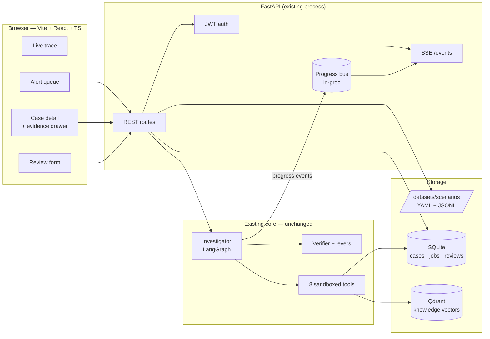

# Design: alert2attack Console

A React + TypeScript analyst UI over the existing alert2attack agent, plus the backend
work required to make that UI possible.

Status: implemented. The build differed from this design in places, and the
corrections are marked where they matter.

## 1. Why this exists

The agent is a CLI and a headless API. It is the interesting part and nobody can
see it work. Two consequences:

1. A reader cannot evaluate it. The README has a placeholder where the demo
   should be. Cloning a repo, installing `uv`, pulling a 7B model and waiting three
   minutes is a barrier almost every reader declines.
2. There is no feedback loop. The eval set is frozen and hand-built. An analyst
   disagreeing with a verdict has nowhere to put that disagreement, so it never
   becomes a test case.

The console addresses both.

### Non-goals

- Not a SOC product. No multi-tenancy, no RBAC, no alert ingestion from real EDRs.
- Not a replacement for the CLI. The CLI stays the primary path for eval runs.
- Not an agent change. The graph, levers, verifier and prompts are out of scope.
  The frozen N=13 test numbers must remain reproducible after this work.

## 2. Requirements

### Functional

| # | Requirement |
|---|---|
| F1 | List available scenarios as an alert queue: host, rule title, severity, fired-at, split. Sort and filter. |
| F2 | Open one case: verdict, confidence, summary, timeline, techniques, scope, next actions, open questions. |
| F3 | Click any citation (`ev-0123`, `rule-…`, `attack-T1003`) and see the underlying event, rule or technique. |
| F4 | Launch an investigation and watch it run live: plan, tool calls, write, verify, repair, levers. |
| F5 | Browse the raw telemetry window independently of the agent: filter by pid, kind, free text. |
| F6 | Record an analyst review: agree / disagree, corrected verdict, free note. |
| F7 | Export reviews as candidate eval cases. |
| F8 | Authenticate. Unauthenticated callers get nothing but `/health`. |
| F9 | Show verification state honestly: a `degraded` case must look degraded. |

### Non-functional

These are deliberately small. Inventing scale requirements this system does not have
would be the wrong instinct, and §6 says what changes when they stop being small.

| # | Requirement | Target |
|---|---|---|
| N1 | Concurrent users | 1 to 3. A demo and its author. |
| N2 | Corpus size | 33 scenarios, ~10³ events each, ~2×10³ knowledge docs. |
| N3 | Investigation latency | 60 to 180 s on a local 7B. This cannot be optimised away, because it is the product. The UI must make waiting legible rather than fast. |
| N4 | Queue / case-detail response | < 200 ms p95. These read SQLite and disk. |
| N5 | First trace event after launch | < 2 s, so the user knows it started. |
| N6 | Availability | Single node, best effort. Restart loses running jobs; completed cases survive. |
| N7 | Cost | $0 marginal. Everything runs locally, including embeddings. |
| N8 | Footprint | `docker compose up` on a laptop. At most one new service. |

### Constraints

- Team of one, ~3 weeks part-time.
- The Python 3.12 / FastAPI / Pydantic v2 / LangGraph backend stays. Strict mypy, ruff,
  39 pytest modules must all stay green.
- The author has no production React experience. The design must therefore avoid
  frameworks whose failure modes need experience to debug (see §7, D5).
- Offline-capable. Ollama sidecar today; no design may introduce a mandatory
  hosted API.

### The constraint that outranks the others

`Scenario.gold` is the answer key. `CaseStore.load_case` already refuses any scenario
carrying it, and the write prompt never sees it. The console adds a new surface that
could leak it to a browser, and if gold ever reaches the client, every number in the
README becomes unciteable. This is treated as a correctness invariant with a test of its
own. See §4.4.

## 3. High-level design



Three rules keep the blast radius small:

1. The agent does not learn about the web. `Investigator` gains one optional
   constructor argument, a `ProgressSink` that defaults to a no-op. It knows nothing
   about HTTP, SSE or jobs.
2. One new container at most, and that is Qdrant. Everything else reuses SQLite, which
   the repo already depends on.
3. The existing API contract is additive only. `POST /investigations` and its
   response shape do not change, so the CLI and the 39 test modules are untouched.

## 4. Deep dive

### 4.1 What the backend is missing

Read of `src/alert2attack/api/app.py` before the console work. Every row is a gap the console needs
closed; none of it is frontend work.

| Gap | Today | Needed |
|---|---|---|
| CORS | No middleware | Browser on `:5173` cannot call `:8000` at all. First commit. |
| Scenario listing | None | `GET /scenarios`. The queue has no data source otherwise. |
| Event access | Tools only, internal | `GET /scenarios/{id}/events` for F5. |
| Evidence resolution | None | `GET /investigations/{id}/evidence/{eid}` for F3, the core interaction. |
| Progress | Trace returned only at the end | Incremental emission for F4. |
| Job durability | `dict` in memory, lost on restart | SQLite-backed store so a case link survives a restart. |
| Auth | None. Compose comment: *"the API has no inbound auth"* | JWT bearer for F8. |
| Payload size | `trace.llm_calls[].messages` carries entire prompts | Excluded from list/detail; behind an explicit flag. |

### 4.2 Progress streaming

The hard part. `Investigator.run_scenario()` is synchronous and returns the trace once,
at the end. F4 needs events as they happen.

Chosen: a `ProgressSink` protocol injected into `Investigator`, defaulting to no-op.

```python
class ProgressSink(Protocol):
    def emit(self, event: ProgressEvent) -> None: ...

class NullSink:                      # default — CLI and every existing test
    def emit(self, event: ProgressEvent) -> None: ...
```

The LangGraph graph already has named nodes, so node entry/exit are natural emission
points, alongside the existing `ToolCallRecord` and `LlmCallRecord` construction sites.
The API passes a `QueueSink` that writes into a per-job `asyncio.Queue` plus a bounded
ring buffer (last 500 events) for reconnect replay.

Rejected alternatives:

- Polling the mutating `Trace` object: no allocation change, but racy, and it
  cannot express "the write node started," only "a record appeared."
- Rewriting `Investigator` as an async generator: cleanest in isolation, touches
  every call site including the eval runner and the CLI. Wrong cost for the benefit.
- Emitting to a log file and tailing it: no new types, but reconnect, ordering and
  cleanup all become file problems.

Event schema (discriminated union on `type`, monotonic `seq`):

| `type` | Payload | UI |
|---|---|---|
| `phase` | `plan` / `investigate` / `write` / `verify` / `repair` / `levers` | Step rail advances |
| `tool_call` | `seq, tool, args_digest, ok, evidence_ids, duration_ms` | Row appends; `ok:false` renders amber, not an error |
| `llm_call` | `seq, role, model, prompt_chars, response_chars, duration_ms` | Token/latency meter |
| `ledger` | `evidence_id, kind` | Ledger counter ticks |
| `verify` | `status, error_codes, stripped_claims, repairs_used` | Verification badge |
| `lever` | `lever_id, fired, effect` | The differentiator. Shows the deterministic controls firing after the model wrote. |
| `done` | `job_id` | Client refetches the case file over REST |
| `error` | `message` | Terminal state |

`done` carries no case file. The stream is for *progress*; the result is fetched over
REST, so there is exactly one authoritative representation of a case file.

Transport is SSE rather than WebSocket. The flow is one-directional, `EventSource`
reconnects on its own, it is plain HTTP through any proxy, and FastAPI does it with
`StreamingResponse` and no new dependency. WebSocket buys bidirectionality this feature
never uses. The HTTP/1.1 six-connections-per-origin cap is real and irrelevant at N1=3.

Reconnect uses `Last-Event-ID` against the ring buffer. Past 500 events, the client
refetches state over REST instead, which degrades the experience without failing.

### 4.3 API surface

Additive. Existing routes keep their shapes.

```
POST   /auth/token                              → { access_token, expires_in }
GET    /me

GET    /scenarios?split=&q=&severity=           → queue rows (gold-stripped)
GET    /scenarios/{id}                          → alert, window, event_count (gold-stripped)
GET    /scenarios/{id}/events?pid=&kind=&q=&cursor=&limit=
                                                → keyset-paginated telemetry

POST   /investigations                          (unchanged)
GET    /investigations?limit=&status=&scenario_id=
GET    /investigations/{id}
GET    /investigations/{id}/events              → text/event-stream
GET    /investigations/{id}/evidence/{eid}      → resolved event | sigma rule | technique
GET    /investigations/{id}/trace?include=messages
                                                → full trace, opt-in

POST   /investigations/{id}/review              → { agrees, corrected_verdict?, note? }
GET    /reviews/export?format=eval_cases
```

Keyset pagination on events (`(ts, event_id)`) rather than offset. The store is already
indexed on `(case_id, kind, ts)`, and offset pagination over a live table is a habit
worth not forming.

`GET /investigations/{id}/evidence/{eid}` dispatches on the existing evidence grammar:

| Prefix | Source | Response |
|---|---|---|
| `ev-NNNN` | `CaseStore.events` | Full `Event` |
| `rule-<slug>` | Vendored Sigma | Rule yaml + title + tags |
| `attack-T####` | ATT&CK knowledge base | Name, description, tactic |

A citation the ledger does not contain returns 404 with the evidence id echoed. The
UI renders that as a red "unverifiable citation" chip. Given the verifier should have
stripped it, a visible 404 is a bug indicator rather than a UI failure, and the console
is the right place to notice it.

### 4.4 The gold boundary

One serializer, one test.

```python
def public_scenario(s: Scenario) -> ScenarioOut:
    return ScenarioOut.model_validate(s.public().model_dump())   # .public() drops gold
```

`ScenarioOut` uses `extra="forbid"` and has no `gold` field, so the failure mode is a
validation error on the server rather than a silent leak to the browser. Backed by:

```python
def test_no_route_leaks_gold(client):
    for path in walk_all_scenario_routes(client):
        body = client.get(path).text
        assert "gold" not in body
        for key in ("acceptable_actions", "unacceptable_actions", "key_pids", "narrative"):
            assert key not in body
```

Crude string matching on purpose: it catches a leak through a field nobody remembered
to type. This test is the reason the design is trustworthy, and it should be written
before the first route.

### 4.5 Data model additions

Two tables in the existing SQLite file. No new database.

```sql
CREATE TABLE jobs (                    -- replaces the in-memory dict
  id TEXT PRIMARY KEY, scenario_id TEXT NOT NULL, model TEXT NOT NULL,
  status TEXT NOT NULL,                -- queued|running|succeeded|failed
  created_at TEXT NOT NULL, updated_at TEXT NOT NULL,
  result_json TEXT, error TEXT
);
CREATE INDEX ix_jobs_created ON jobs(created_at DESC);

CREATE TABLE reviews (                 -- F6/F7, the feedback loop
  id TEXT PRIMARY KEY, job_id TEXT NOT NULL, scenario_id TEXT NOT NULL,
  agrees INTEGER NOT NULL, corrected_verdict TEXT, note TEXT,
  reviewer TEXT NOT NULL, created_at TEXT NOT NULL
);
CREATE INDEX ix_reviews_scenario ON reviews(scenario_id);
```

`JobStore` becomes a `Protocol` with `InMemoryJobStore` (the test default, preserving
existing behaviour exactly) and `SqliteJobStore` (compose). SQLite from FastAPI's
threadpool needs `check_same_thread=False` and WAL mode; at N1=3 that is sufficient and
a single writer lock is not a bottleneck worth removing.

`reviews` is deliberately append-only. A corrected verdict is an *observation*, never a
mutation of a case file. A case file is the record of what the agent said on that run,
and editing it in place would destroy the only honest artifact in the system.

### 4.6 Semantic search

> Correction (week 3). This section was written before anyone read the retrieval
> code, and two of its premises were wrong. `technique_candidates` is not lexical: it
> only reads `attack-T####` ids already in the ledger, so the agent looks techniques
> up by id and nothing searches by meaning. Semantic search was therefore a new
> capability with no lexical baseline to compare against, and the baseline had to be
> built too. The corpus is also far smaller than "order 10³": the vendored ATT&CK
> subset is 30 techniques, chosen around the answer key. The full catalog is 697
> current enterprise techniques. What was built and measured is in
> [`RETRIEVAL_EVAL.md`](RETRIEVAL_EVAL.md). The text below is the original plan.

Today `technique_candidates` is lexical. Adding a vector channel is measurable
through the eval harness that already exists.

- Store: Qdrant, one container, one collection (see §7 D4 for the honest argument
  against).
- Embeddings: `fastembed` with `BAAI/bge-small-en-v1.5`, 384-dim, CPU, local. No
  API key, consistent with the offline-first stack.
- Corpus: ATT&CK technique descriptions, vendored Sigma rules and past case-file
  summaries. Order 10³ documents. Re-embedding costs seconds.
- Retrieval: hybrid, meaning lexical candidates ∪ top-k vector, reciprocal-rank fused.
- Payload filters: `kind`, `tactic`, `platform`.

The measurement protocol is the actual point:

- A/B lexical vs vector vs hybrid through `alert2attack.eval.runner`.
- On the 20 dev scenarios only. The N=13 test split stays frozen. Tuning retrieval
  against the test set would reproduce the mistake already documented in the
  sibling CVE-to-ATT&CK repo, where a post-hoc-tuned 0.504 had to be footnoted into
  uselessness.
- Report technique recall and verdict accuracy deltas with the dev-only caveat stated
  in the README table itself rather than below it.
- A null result ships. "Hybrid retrieval did not beat lexical on 20 dev cases"
  is a publishable finding and reads better than a tuned win.

### 4.7 Frontend structure

```
web/
  src/
    api/          generated types from OpenAPI + typed fetch client
    features/
      queue/       table, filters, severity chips
      case/        verdict header, timeline, techniques, scope, actions
      evidence/    drawer — resolves ev-/rule-/attack- ids
      trace/       SSE hook, step rail, tool-call log, lever badges
      review/      agree/disagree form
    components/   shadcn primitives
    lib/          auth, sse, query client
```

- Server state lives in TanStack Query, with no Redux. Cases are server state with
  cache invalidation, which is the problem Query exists for.
- The URL is the state. `/cases/otrf_empire_mimikatz_logonpasswords?ev=ev-0042` is
  shareable and restores the open drawer. Filters live in query params. This removes
  most of what a client store would otherwise hold.
- SSE goes through a `useInvestigationStream` hook owning the `EventSource` lifecycle,
  reducing events into `{phase, toolCalls[], llmCalls[], levers[], verification}`.
  On `done`, invalidate the case query and let Query refetch, so there is one
  authoritative source and no duplicated parsing.
- Types are generated from FastAPI's OpenAPI via `openapi-typescript`, wired into CI.
  Pydantic models are already the contract; hand-written TS interfaces would be a
  second, drifting copy of it.

### 4.8 Auth

`POST /auth/token` checks a single credential from env (`CONSOLE_USER`,
`CONSOLE_PASSWORD_HASH`, argon2), returns a 30-minute HS256 JWT. All routes except
`/health` and `/auth/token` depend on `require_user`.

The token is held in memory in a React context rather than `localStorage`, which is
readable by any injected script, and a console that renders attacker-controlled command
lines is precisely the wrong place to be relaxed about XSS. Cost: a refresh loses the
session. Correct trade at N1=3.

This is demo-grade and should be labelled as such in the README. A real deployment uses
the organisation's OIDC provider. Shipping a hand-rolled user table would be worse than
shipping none.

### 4.9 Errors and failure

| Failure | Backend | UI |
|---|---|---|
| Tool returns `ok:false` | Already data, not an exception | Amber row in the log. Not an error state. |
| Verification `degraded` | Already in the report | Prominent banner: claims were stripped. Never hidden. |
| LLM timeout / Ollama down | Job → `failed`, `error` SSE event | Retry affordance, error text shown |
| SSE drop | Ring buffer + `Last-Event-ID` | Auto-reconnect, silent under 500 events |
| Job lost to restart | `running` older than TTL becomes `failed` on startup sweep | "Interrupted, rerun" |
| Unknown evidence id | 404, id echoed | Red "unverifiable citation" chip |

No retry logic on investigations. A 7B run costs 60 to 180 s and an automatic retry
doubles that for a failure the user should see. Retry is a button.

## 5. Build order

Each week ends with something demonstrable, because a project that is 80%
done in three places is worth little.

Week 1, backend enablers and static UI. CORS; `GET /scenarios`; `GET /scenarios/{id}`;
`GET /scenarios/{id}/events`; evidence resolution; `public_scenario` + the leak test;
`SqliteJobStore`. Then Vite scaffold, queue table, case detail, evidence drawer.
*Demo: click an alert, read the case file, click `ev-0042`, see the raw Sysmon event.*

Week 2, the part people remember. `ProgressSink` + `QueueSink` + ring buffer; SSE
route; `useInvestigationStream`; step rail and lever badges; JWT; review form.
*Demo: press Investigate and watch the agent work, including lever 6 firing on a benign
LSASS case.*

Week 3, semantic search, measured, then ship. *(Superseded: see the correction in
§4.6 and [`RETRIEVAL_EVAL.md`](RETRIEVAL_EVAL.md).)* Qdrant container, fastembed indexer,
hybrid retrieval behind a flag; A/B on the 20 dev scenarios through the eval runner;
README results block with the dev-only caveat; Playwright smoke test; CI; deploy;
60-second GIF.

Cut order under time pressure: Qdrant first (§4.6 is the weakest-linked requirement),
then auth, then review export. Never cut the leak test or the SSE trace. One
protects the repo's credibility, the other is the reason to look at it.

## 6. Scale and reliability

What exists is right-sized for N1 to N8. What would change if it were not:

| Pressure | Breaks | Change |
|---|---|---|
| 50 analysts | `BackgroundTasks` runs jobs in the API process | Redis + RQ/Celery, workers separate from API |
| >1 API replica | In-process bus, so an SSE client may hit a replica that never saw the job | Redis pub/sub for progress events |
| 10k alerts/day | Single 7B serialises | vLLM with continuous batching; queue depth as the SLO |
| Millions of events | SQLite single-writer | Postgres + partitioning; pgvector absorbs Qdrant |
| Real SOC | Demo JWT, no audit trail | OIDC, RBAC, ledger becomes the audit log with retention |
| Real EDR | Scenarios are static YAML | Ingestion, schema mapping, dedup, backpressure |

None of it should be built now. The honest reliability statement is: single node,
best effort; completed cases durable, running jobs are not. Restart marks stale
`running` jobs `failed` rather than leaving them to hang, and the user reruns.

Observability already exists through `/metrics` and structlog. Add: SSE connections
gauge, progress-event lag histogram, review counter, retrieval-channel counter.
Prometheus is already a dependency; no new stack.

## 7. Decisions and trade-offs

D1, SSE over WebSocket. Need is one-directional; `EventSource` reconnects free; no
new dependency. *Cost:* no client-to-server channel, so cancelling an investigation
needs a REST call. Acceptable. *Revisit* if the UI ever steers a running agent.

D2, `ProgressSink` over an async rewrite. Smallest diff, existing tests and CLI
untouched, default no-op. *Cost:* a second path (sink + trace) describing the same run,
which can drift. Mitigated by building both from the same records. *Revisit* if a third
consumer appears.

D3, SQLite over Postgres. Already a dependency, zero new containers, meets N1/N2
comfortably. *Cost:* single-writer; no `pgvector`, hence a separate vector store.
*Revisit* the moment concurrency or pgvector consolidation matters, which is the point
where D3 and D4 collapse into one decision.

D4, Qdrant over sqlite-vec. *The weakest decision in this document, and it should
be read as such.* sqlite-vec is the better engineering answer at this scale: zero new
services, the same file, the same backup story, and ~10³ documents where a dedicated
vector database is unambiguous overkill. Qdrant was chosen to work hands-on with a
dedicated vector database and its embedded mode, at the cost of a dependency this
corpus does not need. That is a preference, not a technical requirement, and it is
written down so the decision can be reversed on merit. *Revisit:* sqlite-vec is the
correct migration if the extra dependency stops being worth it, and the corpus is small
enough that it costs an afternoon.

D5, Vite over Next.js. No SSR, no SEO, no server-side data needs; the backend is
Python. Next would add a Node server to a Python stack for routing alone. Vite's failure
modes are also shallower, which matters given the author's React inexperience.
*Cost:* no file-based routing or RSC. *Revisit:* never, for this system.

D6, generated types over hand-written. Pydantic models are the contract; a second
hand-maintained copy drifts silently. *Cost:* a build step and generated code in review
diffs. Worth it.

D7, dev-split-only retrieval evaluation. Costs statistical power (20 cases) and
almost certainly a better headline number. Buys the ability to cite the result at all.
The sibling repo's footnoted 0.504 is the argument.

## 8. Risks

| Risk | Mitigation |
|---|---|
| Demo too slow to film, since a 7B run is 60 to 180 s | Add a `replay` model that streams a stored trace at realistic pacing. Also a great test fixture, and it makes the GIF reproducible. |
| React inexperience burns week 1 | Scaffold the queue table first, the most conventional screen in the project. shadcn/ui supplies primitives rather than requiring CSS invention. |
| Scope creep into UI polish | Week boundaries are demo gates. An ugly working trace beats a beautiful static case view. |
| Gold leak | §4.4 test, written before the first route. |
| Qdrant container breaks `compose up` on a clean machine | Retrieval behind a flag, default off. Lexical path must work with Qdrant absent. |
| Backend refactor breaks the frozen N=13 | `NullSink` default means the CLI path is byte-identical. Re-run the eval suite at the end of week 2 and record the hash in `docs/STATUS.md`. |

## 9. Open questions

1. Should the console be able to *launch* investigations against arbitrary scenarios,
   or only replay stored ones? Launching is more impressive and needs Ollama running
   during any demo. *Leaning: both, with replay as the default path.*
2. Does the review loop write eval cases directly, or export for manual curation?
   Direct writes risk a feedback loop that quietly pollutes the dev split.
   *Leaning: export only.*
3. Is `web/` a subdirectory of this repo or a sibling repo? Subdirectory keeps the
   demo one `compose up`; it also puts Node tooling into a Python repo's CI.
   *Leaning: subdirectory, separate CI job.*

## 10. First commits

Work starts from `main`. The checkout at the time was on `docs/readme-glossary-diagrams`.

```
git checkout main && git checkout -b feat/console-backend-enablers
```

1. `test_no_route_leaks_gold`, failing, with no routes yet.
2. CORS middleware, origins from env.
3. `ScenarioOut` + `public_scenario` + `GET /scenarios`.
4. `GET /scenarios/{id}` and `/events` with keyset pagination.
5. Evidence resolution endpoint.
6. `JobStore` protocol + `SqliteJobStore`, `InMemoryJobStore` still the test default.

Six commits, all backend, all testable without a browser. The React scaffold lands
after the API it consumes exists.
